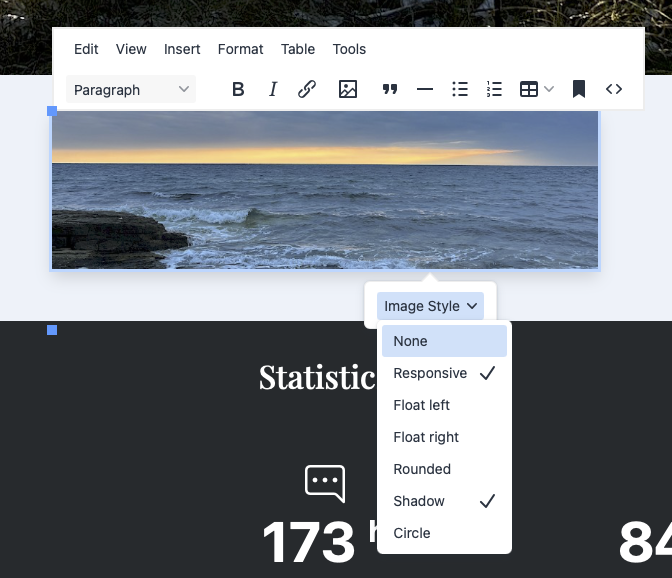
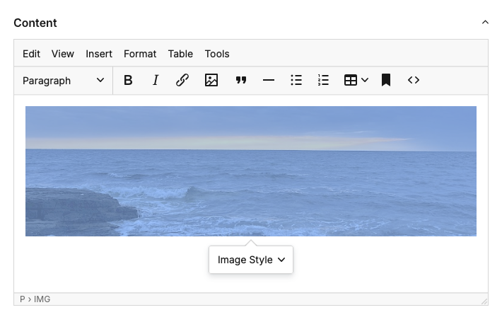
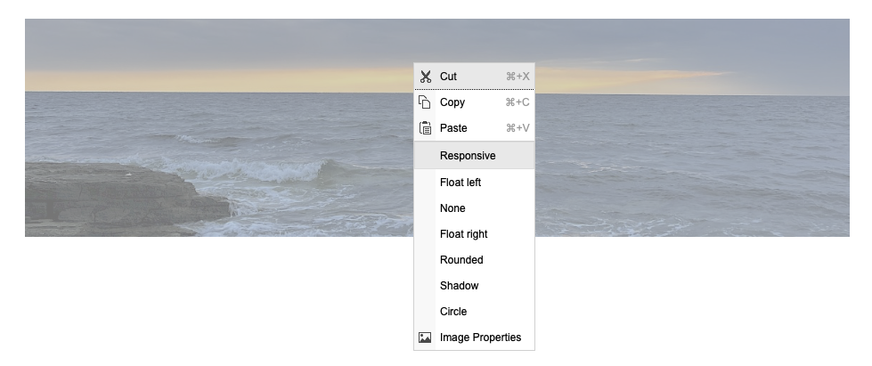

# Image Classes

A ProcessWire module that adds a configurable CSS class selector for images inside TinyMCE and CKEditor fields — in both the admin and the frontend editor.



When a user clicks an image inside a rich-text field a floating toolbar appears (TinyMCE) or the browser context menu is extended (CKEditor) with an **Image Style** picker. Classes are written directly into the `` element in the saved HTML — no post-processing, no render-time magic. Multiple classes can be active at the same time.

---

## Features

- Works in the **admin** and in the **frontend (inline) editor**
- Supports **TinyMCE 6** (ProcessWire's default) and **CKEditor 4**
- **Multi-select** — assign more than one class to an image at once
- **Active-state indicator** — a checkmark shows which classes are currently applied
- **Toggle** — selecting an active class removes it again
- **"None"** entry strips all managed classes while leaving any unrelated classes intact
- Fully configurable class list through the module settings page
- No field assignment required — install and it works everywhere

---

## Requirements

| | |
|---|---|
| ProcessWire | 3.0.0 or newer |
| PHP | 8.0 or newer |
| TinyMCE | 6.x (bundled with `InputfieldTinyMCE`) |
| CKEditor | 4.x (bundled with `InputfieldCKEditor`) |

---

## Installation

1. Copy the `ProcessImageClasses` folder into `/site/modules/`.
2. In the ProcessWire admin go to **Modules → Refresh**.
3. Find **Image Classes** and click **Install**.

That's it. The module is autoloaded and requires no further field configuration.

---

## Configuration

Go to **Modules → Configure → Image Classes**.

Enter one class per line using the format:

```
Label=css-class
```

**Examples**

```
None=
Responsive=img-fluid
Float left=float-start
Float right=float-end
Rounded=rounded
Shadow=shadow
```

- The label is what appears in the editor menu.
- Leave the value empty (e.g. `None=`) to provide a "remove all classes" option.
- The order of entries determines the order in the menu.

---

## Usage

### TinyMCE



Click any image inside a rich-text field. A floating context toolbar appears above the image with an **Image Style** dropdown. Each entry shows a checkmark when that class is active. Selecting it again removes the class.

### CKEditor



Right-click any image. The browser context menu contains the configured class entries at the top. Active classes are marked. Clicking an entry toggles it.

---

## How it works

The module hooks into ProcessWire's `ready()` lifecycle:

- **Admin pages** — assets are queued via `$config->scripts` and `$config->js()`. The AdminTheme outputs them as normal `<script>` tags in the page, never inside AJAX field fragments (which would break jQuery's `globalEval`).
- **Frontend pages** — a `Page::render` hook injects the config object and a `<script src>` tag immediately before `</body>` on the fully rendered HTML, so the script is present before any TinyMCE instance initialises lazily on hover.

The JavaScript uses `InputfieldTinyMCE.onSetup()` to register the UI for every editor instance: normal, inline, lazy-loaded, and frontend. A `setInterval` poll catches editors that initialise after the script itself loads.

---

## License

Licensed under the MIT License.

---

## Credits

Developed by [frameless.at](https://frameless.at/en).
